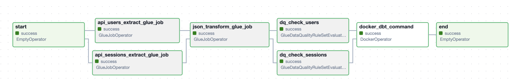

# DeFtunes Music Purchase Data Pipeline

## Project Overview

The **DeFtunes Music Purchase Data Pipeline** is an end-to-end solution designed to enable data analytics for a new music purchase feature at DeFtunes—a subscription-based music streaming service. This pipeline ingests, transforms, and stores purchase data to facilitate comprehensive analysis on song purchases, user behavior, and service trends.

## Architecture


### Star Schema Data Model

The data model is designed in a star schema format to optimize analytical queries, centered around a fact table and multiple dimension tables.

#### Fact Table

- **fact_session**: Captures details of each song purchase session.

#### Dimension Tables

- **dim_songs**: Contains song details such as title, release year, and track ID.
- **dim_artists**: Provides artist information including artist name and MusicBrainz Identifier.
- **dim_users**: Stores user data like name, subscription date, location, and country code.

## Data Pipeline Orchestration

The pipeline is orchestrated using Apache Airflow and includes the following DAGs:

### API DAG



### Songs DAG


## Running the Project

Follow the steps below to set up and run the data pipeline:

### Steps

Before initializing terraform make sure to have the AWS environment setup through the ```template.yml``` file, which will setup a VSCode in an EC2 instance.


1. **Initialize Terraform**

   ```bash
   cd terraform
   terraform init
   ```

2. **Apply Terraform Configurations**

   **Extract Data**

     ```bash
     terraform apply -target=module.extract_job
     ```

   **Transform Data**

     ```bash
     terraform apply -target=module.transform_job
     ```

   **Set Up Serving Layer**

     ```bash
     terraform apply -target=module.serving
     ```

3. **Run AWS Glue Jobs**

   Use the outputs from Terraform to execute AWS Glue jobs that create the necessary tables.

4. **Apply Data Quality Configuration**

   ```bash
   terraform apply -target=module.data_quality
   ```

5. **Run Airflow DAGs**

   Trigger the following DAGs in Airflow to execute the data pipeline:

   **deftunes_api_pipeline_dag**

   **deftunes_songs_pipeline_dag**

## Technologies Used

- **Data Extraction and Transformation**: AWS Glue, Apache Iceberg
- **Data Storage**: AWS S3, Amazon Redshift Spectrum
- **Orchestration**: Apache Airflow
- **Data Modeling**: dbt (Data Build Tool)
- **Visualization**: Apache Superset
- **Infrastructure as Code**: Terraform
